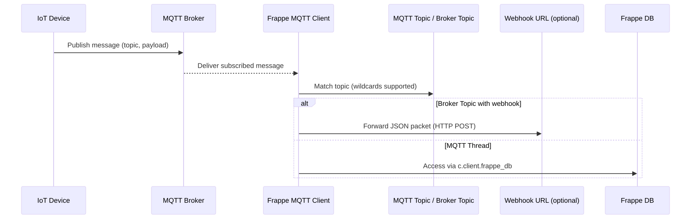

# Frappe MQTT

> **Frappe MQTT - V0.0.3**  
> Easily connect Frappe/ERPNext apps with IoT devices and real-time systems using MQTT messaging. The app supports single or multiple brokers, auto-subscribes from DocTypes, publishes JSON messages, hot-reloads credentials, and operates through simple server APIs. Build event-driven workflows and IoT-ready applications seamlessly within Frappe.

---

## Table of Contents

1. [Overview & Use Cases](#overview)  
2. [Key Features](#key-features)  
3. [Requirements](#requirements)  
4. [Installation](#installation)  
5. [Configuration](#configuration)  
   - [Config via `site_config.json` (single or multiple brokers)](#config-via-site_configjson-single-or-multiple-brokers)  
   - [MQTT Broker DocType](#mqtt-broker-doctype)  
   - [MQTT Topic DocType (Auto‑Subscribe)](#mqtt-topic-doctype-auto-subscribe)  
   - [Broker Topic DocType (Webhook Forwarding)](#broker-topic-doctype-webhook-forwarding)   
6. [Usage (Python API)](#usage-python-api)  
   - [Getting a client](#getting-a-client)  
   - [Publishing (single broker or broadcast)](#publishing-single-broker-or-broadcast)  
   - [Subscribing](#subscribing)  
   - [Overriding `on_message` with `frappe_db`](#overriding-on_message-with-frappe_db)   
   - [Hot reload behavior](#hot-reload-behavior)  
7. [Usage (Server API — `api.py`)](#usage-server-api--apipy)  
   - [`frappe_mqtt.api.clients`](#frappe_mqttapiclients)  
   - [`frappe_mqtt.api.publish`](#frappe_mqttapipublish)  
   - [`frappe_mqtt.api.broker_history`](#frappe_mqttapibroker_history)  
   - [`frappe_mqtt.api.flush_retained`](#frappe_mqttapiflush_retained)  
8. [Flushing Retained Messages](#flushing-retained-messages)  
9. [Local Testing with Eclipse Mosquitto](#local-testing-with-eclipse-mosquitto)  
   - [Linux / macOS / Windows installs](#linux--macos--windows-installs)  
   - [Docker one‑liner](#docker-one-liner)  
   - [Quick CLI test](#quick-cli-test)  
10. [Security & Warnings](#security--warnings)  
11. [Troubleshooting](#troubleshooting)  
12. [FAQ](#faq)  
13. [Development & Testing](#development--testing)   
14. [License](#license)

---

## Overview & Use Cases

**Frappe MQTT** embeds MQTT client in Frappe site(s). Use-case includes but not limited to:

- **IoT ingestion**: receive device telemetry (e.g., `sensors/#`) and trigger workflows.
- **ERP events → field devices**: publish status updates/orders to devices.
- **System telemetry**: consume `$SYS/#` and broker metrics for monitoring.
- **Cross‑system glue**: bridge legacy systems by publishing/consuming JSON messages.
- **Webhook forwarding**: push MQTT payloads to external HTTP endpoints automatically. 
- **Database logging**: safely create/update Frappe documents from MQTT callbacks using `frappe_db`. 

It supports **multiple brokers**, **auto‑subscription** from DocTypes, **JSON‑only payloads**, **webhooks**, **thread-safe DB access**, and **hot reload** when credentials change.

---

## Key Features  (Enhanced)

- **Multi‑broker** support via `site_config.json` and/or **MQTT Broker** DocType.
- **Auto‑subscription** from **MQTT Topic** DocType on (re)start/reload.
- **Webhook forwarding** via **Broker Topic** DocType — forward messages to HTTP endpoints. 
- **Publish** JSON payloads; payloads are auto‑extended with `timestamp`.
- **Hot reload** when `site_config.json` or Broker DocType changes.
- **Flush retained** messages (single topic, wildcard branch, or all).
- **Role‑based**: use Frappe permissions to secure access to server methods if required (MQTT role).
- **Scheduler-Based Client Lifecycle** — clients auto-initialize on bench migrate or DocType update. 
- **Thread-Safe Database Access** — each client exposes `c.client.frappe_db` for safe `get_doc`, `new_doc`, `get_list`, `get_all` in MQTT threads. 
- **Retained Message History API** — fetch latest retained state for monitoring or sync. 

---

## Requirements

- Frappe **>=v15** (Python 3.10+ recommended)  
- Paho‑MQTT **2.1.0** (MQTT v5 protocol) 
- Optional TLS certificates for secure brokers
- Broker (MQTTV5 protocol) *

---

## Installation

```bash
# In your bench
bench get-app github.com/mymi14s/frappe_mqtt
bench --site yoursite install-app frappe_mqtt

bench --site yoursite clear-cache
bench restart
```

Assign **MQTT role** to users who will call server APIs or configure DocTypes.

---

## Configuration

You can configure brokers in **two** ways — both can coexist.

### Config via `site_config.json` (single or multiple brokers)

Edit your site’s `site_config.json` and add an `mqtt_config` section.

**Single broker example**:
```json
{
  "mqtt_config": [
      {
          "name": "default",
          "host": "localhost",
          "port": 1883,
          "username": "",
          "password": "",
          "ca_certs": "",
          "certfile": "",
          "keyfile": "",
          "tls_insecure": 0,
          "keepalive": 60,
          "error_topic": "errors/frappe"
      }
  ]
}
```

**Multiple brokers + TLS example**:
```json
{
  "mqtt_config": [
    {
        "name": "default",
        "host": "localhost",
        "port": 1883,
        "username": "",
        "password": "",
        "ca_certs": "",
        "certfile": "",
        "keyfile": "",
        "tls_insecure": 0,
        "keepalive": 60,
        "error_topic": "errors/frappe"
    },
    {
        "name": "hivemq",
        "host": "localhost",
        "port": 1883,
        "username": "",
        "password": "",
        "ca_certs": "",
        "certfile": "",
        "keyfile": "",
        "tls_insecure": 0,
        "keepalive": 60,
        "error_topic": "errors/frappe"
    }
  ]
}
```

> **Notes**
> - `host` and `port` are required.
> - Credentials and TLS files are optional.
> - The top‑level keys (`default`, `secure`, etc.) are **broker keys** used by the API.

### MQTT Broker DocType

ROLE MQTT is required to use the doctypes.

Create **MQTT Broker** documents in Desk to define brokers at runtime:

- **Broker Key** (unique): e.g., `production`, `lab`, etc.  
- **Host**, **Port**  
- **Username**, **Password** (optional; Password field recommended)  
- **TLS**: CA / cert / key (optional)

Brokers defined here are managed the same way as those from `site_config.json`. The app can use **both** sources simultaneously.

### MQTT Topic DocType (Auto‑Subscribe)

Create **MQTT Topic** records to declare subscriptions the client should maintain:

- **Topic Filter**: e.g., `sensors/#`, `devices/+/status`  
- **Broker**: which broker key to use (leave blank to subscribe on **all active brokers**) 

On client start or reload, the app auto‑subscribes to all saved topics.

### Broker Topic DocType (Webhook Forwarding) 

This is an extension of **MQTT Topic** with webhook capabilities.

- Inherits all fields from **MQTT Topic**
- Adds `webhook_url` (string): HTTP endpoint to forward incoming messages to
- When a message arrives on the subscribed topic, it is POSTed as JSON to the `webhook_url`

> Example payload sent to webhook:
> ```json
> {
>   "topic": "sensors/temperature",
>   "payload": {"value": 25.3, "unit": "C"},
>   "qos": 0,
>   "retain": false,
>   "timestamp": "2025-04-05T10:30:00.123456"
> }
> ```

---

## Usage (Python API)

Import helpers from `utility.py`.

### Getting a client

```python
from frappe_mqtt.mqtt_utility import get_client

# by broker key (from site_config.json or Broker DocType)
client = get_client("default")  # or "secure", "production", etc.
```

### Publishing (single broker or broadcast)

```python
# Single broker
client.publish("devices/device42/state", {"status": "active"}, qos=0, retain=False)

# Broadcast the same message to ALL connected brokers
client.publish("system/restart", {"notice": "rolling"}, broadcast=True)
```

> The client **extends** your payload automatically with:
>
> ```json
> {
>   "timestamp": "YYYY-MM-DDTHH:MM:SS.mmmmmm"
> }
> ```
>
> Payload must be a **dict** (or JSON‑serializable).

### Subscribing

```python
# Subscribe to a topic filter (wildcards +/# supported by the broker)
client.subscribe("sensors/+/status", qos=0)
```

### Overriding `on_message` with `frappe_db` 

You can attach your own `on_message` handler for advanced processing — including **safe database access** via `client.frappe_db`.

```python
# your_app/handler.py

import json

def on_message(self, client, userdata, message_dict, raw):
    # Access raw MQTT message
    print("Topic:", raw.topic)
    print("Payload:", message_dict)

    # Thread-safe Frappe DB access
    db = client.frappe_db  #  This is key!

    # Example: Create a new document
    log = db.new_doc({
        "name": "vjhbgdfckn",
        "doctype": "Temperature Log",
        "timestamp": frappe.utils.now(),
        "value": message_dict.get("value", 0)
    })
    log.insert()

    # Example: Fetch existing doc
    user = db.get_doc("User", "Administrator")
    print("Admin:", user.full_name)

    # Example: Query recent logs
    recent = db.get_list("Temperature Log", fields=["timestamp", "value"], limit=5)
    print("Recent:", recent)

# your_app/__init__.py
from frappe_mqtt.mqtt_utility import MQTTClient
from your_app.handler import on_message

MQTTClient.on_message = on_message
```

> The built‑in logic validates JSON.  
> Attachments to `c.client` are standard **Paho‑MQTT** hooks.  
> `frappe_db` supports: `get_doc`, `new_doc`, `get_list`, `get_all`, `set_value`, etc. 

### Hot reload behavior

- Changing **MQTT Broker** DocType normally triggers a client reload for that broker.
- bench start/serve runs the client
- bench migrate, works same as scheduler.  
- Updating **`site_config.json`** requires either calling your reload helper (if provided) or restarting the bench.  
- Calling `get_client(key)` returns an existing connection or creates/reloads it if needed.

---

## Usage (Server API `api.py`)

All endpoints are **whitelisted** and return JSON‑serializable output. Currently it is secured with Role MQTT.

### `frappe_mqtt.api.clients`

Return available broker keys.

```python
# frappe.call (JS) or server call (Python)
# -> {"clients": ["default", "secure", ...]}
```

### `frappe_mqtt.api.publish`

Publish JSON payload to one broker or broadcast to all.

**Args**:
- `topic` (str) — required
- `payload_json` (str) — JSON string
- `qos` (int: 0/1/2) default 0
- `retain` (int: 0/1) default 0
- `client_key` (str|None) — which broker; ignored if `broadcast=1`
- `broadcast` (int: 0/1) — publish to all

**Example** (JS):
```js
frappe.call({
  method: "frappe_mqtt.api.publish",
  args: {
    topic: "devices/alpha/state",
    payload_json: JSON.stringify({ status: "online" }),
    qos: 0, retain: 0, client_key: "default", broadcast: 0
  }
})
```

### `frappe_mqtt.api.broker_history`

Fetch a **snapshot** of retained (or recent) messages matching a topic filter.

**Args**:
- `topic` (str) — e.g., `sensors/#`
- `limit` (int) — default 100
- `timeout_ms` (int) — how long to wait for retained packets (default ~1200ms)
- `client_key` (str|None) — which broker

**Returns**: list of messages like
```json
[
  {"topic": "sensors/lab/temp", "payload": {"t": 22.1}, "qos": 0, "retain": 1, "timestamp": "..."}
]
```

### `frappe_mqtt.api.flush_retained`

**Clear retained messages** for a single topic, a wildcard branch, or **all** topics.

**Args**:
- `client_key` (str|None) — broker key (default: `"default"`)
- `topic` (str|None) — exact topic or wildcard (ignored if `clear_all=1`)
- `clear_all` (int: 0/1) — set to `1` to clear **all** retained topics
- `timeout` (float) — seconds to discover retained topics for wildcard/all (default ≈ 1.5)
- `qos` (int) — QoS used for the clearing publishes (default 0)

**Example**:
```js
// clear a single retained message
frappe.call({
  method: "frappe_mqtt.api.flush_retained",
  args: { client_key: "default", topic: "devices/x/status", clear_all: 0 }
})

// clear all retained under a branch
frappe.call({
  method: "frappe_mqtt.api.flush_retained",
  args: { client_key: "default", topic: "devices/#", clear_all: 0, timeout: 2.0 }
})

// clear ALL retained messages on the broker
frappe.call({
  method: "frappe_mqtt.api.flush_retained",
  args: { client_key: "default", clear_all: 1 }
})
```

**Returns**:
```json
{ "cleared": ["devices/x/status", "..."], "count": 2, "mode": "wildcard", "filter": "devices/#" }
```

---

## Flushing Retained Messages

MQTT “delete retained” = **publish zero‑length payload with `retain=True`** to that topic.

- CLI example (Mosquitto):
  ```bash
  mosquitto_pub -h localhost -t "sensors/temp" -n -r
  ```

- Python example:
  ```python
  c = get_client("default")
  # exact topic
  c.client.publish("sensors/temp", payload=b"", qos=0, retain=True)
  # or use the helper via server API
  frappe.call("frappe_mqtt.api.flush_retained", {"topic": "sensors/#"})
  ```

The provided `flush_retained` API handles discovery for wildcard/clear‑all by briefly subscribing, collecting retained topics, then clearing them.

---

## Local Testing with Eclipse Mosquitto

A local broker is ideal for development.

### Linux / macOS / Windows installs

**Ubuntu/Debian**:
```bash
sudo apt update
sudo apt install mosquitto mosquitto-clients #insure installed or remote broker support MQTTv5
```

**Alternative: Snap (Ubuntu, Fedora, etc.)** 
```bash
sudo snap install mosquitto
sudo snap start mosquitto
```

**macOS (Homebrew)**:
```bash
brew install mosquitto
brew services start mosquitto
```

**Windows**:
- Download the latest installer from [Mosquitto Binary Downloads](https://mosquitto.org/files/binary/) 
- Install and ensure `mosquitto.exe` is in PATH.

Start the broker (default 1883):
```bash
mosquitto
```

### Docker one‑liner

```bash
docker run -it --name mosq -p 1883:1883 eclipse-mosquitto
```

### Quick CLI test

Terminal A (subscribe):
```bash
mosquitto_sub -h localhost -t test/topic -v
```

Terminal B (publish JSON):
```bash
mosquitto_pub -h localhost -t test/topic -m '{"hello":"world"}'
```

Configure your site to use it:
```json
{
  "mqtt_config": [
    {
        "name": "default",
        "host": "localhost",
        "port": 1883,
        "username": "",
        "password": "",
        "ca_certs": "",
        "certfile": "",
        "keyfile": "",
        "tls_insecure": 0,
        "keepalive": 60,
        "error_topic": "errors/frappe"
    },
  ]
}
```
Restart bench and use the APIs against `client_key="default"`.

---

## Security & Warnings

- **Use TLS** (8883) for production; supply CA/cert/key files.
- **Validate** incoming JSON before acting on it.
- Avoid very large payloads (>1 MB).
- Respect broker **ACLs**: you may need permissions to publish retained clears.
- Broadcast publishing can fan out to many brokers — use with care.
- Store secrets in `site_config.json` or password fields, not in code.

---

## Troubleshooting

- **Cannot connect**: verify `host`, `port`, and firewall rules; try `mosquitto_sub` first.
- **TLS errors**: check certificate paths and broker’s CA chain; ensure port 8883.
- **No messages**: confirm the broker has retained messages (`mosquitto_sub -R`), and your filters match.
- **Hot reload**: Broker DocType saves should reconnect; for `site_config.json` changes.
- **Unicode/JSON errors**: ensure publishers send valid UTF‑8 JSON strings.
- **Database access in threads**: Always use `client.frappe_db`, never raw `frappe` calls in MQTT callbacks. 

---

## FAQ

**Can I define brokers both in `site_config.json` and via DocType?**  
Yes. Both sources are merged; broker keys must be unique.

**How do I pick a specific broker?**  
Pass the broker key to `get_client("mykey")` or set `client_key` in the API call.

**How do I wipe all retained messages?**  
Call `frappe_mqtt.api.flush_retained` with `clear_all=1` for the chosen broker.

**How do I trigger a webhook?**  
Create a **Broker Topic** DocType with a `webhook_url` and matching topic. Incoming messages are auto-forwarded. 

**Can I access the database from an MQTT message handler?**  
 Yes — use `client.frappe_db.get_doc(...)`, `client.frappe_db.new_doc(...)`, etc. Do NOT use `frappe.get_doc(...)` directly — it’s unsafe in threads.

---

## Message Flow Diagram 



---

## License

MIT © 2025

---
